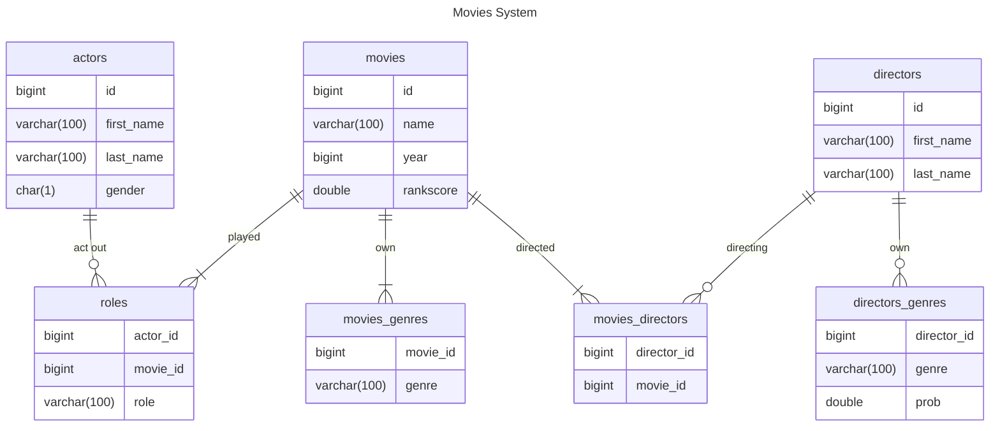

# ERD Movies System

```mermaid
---
    title: Movies System
---
erDiagram
    movies {
        bigint id
        varchar(100) name
        bigint year
        double rankscore
    }

    actors {
        bigint id
        varchar(100) first_name
        varchar(100) last_name
        char(1) gender
    }

    directors {
        bigint id
        varchar(100) first_name
        varchar(100) last_name
    }

    roles {
        bigint actor_id
        bigint movie_id
        varchar(100) role
    }

    movies_genres {
        bigint movie_id
        varchar(100) genre
    }

    movies_directors {
        bigint director_id
        bigint movie_id
    }

    directors_genres {
        bigint director_id
        varchar(100) genre
        double prob
    }

    movies ||--|{ roles : played
    actors ||--o{ roles : "act out"
    movies ||--|{ movies_genres : own
    directors ||--o{ movies_directors : directing
    movies ||--|{ movies_directors : directed
    directors ||--o{ directors_genres : own


```
